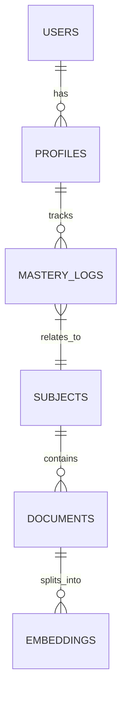

# 🎓 AI Academic Agent: Project Blueprint

> [!NOTE]
> This blueprint consolidates the core architecture with additional components utilized in development (Streamlit, Email Services, PlantUML).

## 1. System Architecture Overview

The AI Academic Agent is a **Governed Socratic Engine** designed for institutional learning. It enforces curriculum boundaries while providing adaptive, multimodal support.

### 🏗️ Tech Stack (The "Machinery")

| Component | Technology | Role |
| :--- | :--- | :--- |
| **Frontend (UI)** | **Streamlit** | Rapid, interactive dashboards for Admin & Teacher portals. |
| **Backend API** | **FastAPI (Python)** | High-performance async/await API for business logic & AI orchestration. |
| **Database** | **Supabase (PostgreSQL)** | Relational data (users, quizzes) + Vector data (pgvector). |
| **AI Orchestration** | **LangChain / LangGraph** | Managing conversation state, RAG chains, and Socratic logic. |
| **LLM** | **Google Gemini 1.5 Flash** | Core reasoning engine for Q&A, quiz generation, and summaries. |
| **Serverless Functions**| **Supabase Edge Functions** | Handling trigger-based events like **Email Notifications**. |
| **Documentation** | **PlantUML** | Visualizing architecture, sequence diagrams, and workflows. |
| **Accessibility** | **Web Speech API** | Browser-native STT/TTS for voice interaction. |

---

## 2. Core Modules & Features

### 🧠 A. The Governed RAG Pipeline
*   **Goal**: Restrict AI answers to approved university curriculum.
*   **Mechanism**:
    1.  **Ingestion**: Faculty uploads PDFs -> Text Extraction (PyMuPDF) -> Chunking -> Embedding (Gemini) -> Storage (Supabase pgvector).
    2.  **Retrieval**: Student Query -> Embedding -> Similarity Search -> Context Assembly.
    3.  **Governance**: System prompt enforces "University Material Only" and "Socratic Method" (don't give answers, guide them).

### 🎓 B. Socratic Quiz Engine
*   **Contextual**: Generates quizzes based on the *current* conversation topic.
*   **Adaptive**: Difficulty scales with the student's **Mastery Score** (tracked in Supabase).
*   **Feedback**: Instant corrections with explanations, updating the mastery record.

### 📧 C. Communication System (New)
*   **Service**: Supabase Edge Functions (Deno).
*   **Triggers**:
    *   Welcome emails upon registration.
    *   Quiz performance summaries.
    *   Alerts for "At Risk" students (sent to Teachers).
*   **Integration**: REST calls from FastAPI or Database Webhooks.

### 📊 D. Visualization & Documentation (New)
*   **PlantUML**: Automated generation of:
    *   Class Diagrams (backend structure).
    *   Sequence Diagrams (RAG flow).
    *   ER Diagrams (Database schema).

---

## 3. Portal Breakdown

### 🧑‍🎓 Student Portal
*   **Interface**: Chat-centric UI with Voice input/output.
*   **Features**:
    *   **Study Companion**: Ask questions, get guided hints.
    *   **Quiz Zone**: Take adaptive quizzes.
    *   **Progress View**: Simple visual mastery tracking.

### 👩‍🏫 Teacher Portal (Streamlit)
*   **Interface**: Data-rich dashboard.
*   **Features**:
    *   **Heatmaps**: View class performance by topic.
    *   **Content Manager**: Upload/Remove curriculum PDFs.
    *   **Intervention List**: View students flagged by the system.

### 🛡️ Admin Portal (Streamlit)
*   **Interface**: Management console.
*   **Features**:
    *   **User Management**: Approve/Revoke access (Domain Lockdown).
    *   **Audit Logs**: Review flagged interactions (Academic Integrity).
    *   **System Health**: Monitor API latency and Error rates.

---

## 4. Database Schema (Simplified)

## 5. Implementation Roadmap

### Phase 1: Core Infrastructure
- [x] Database Setup (Supabase + pgvector)
- [x] Basic FastAPI Backend
- [ ] Domain Lockdown (Auth Policies)

### Phase 2: Intelligence Layer
- [ ] RAG Pipeline & Knowledge Vault Ingestion
- [ ] Socratic Logic Implementation (LangChain)
- [ ] **PlantUML** integration for dynamic diagrams

### Phase 3: Interaction & Interfaces
- [ ] **Streamlit** Dashboards (Teacher/Admin)
- [ ] Student Chat Interface with Voice (Web Speech API)
- [ ] **Email Notification** System (Edge Functions)

### Phase 4: Polish & Deploy
- [ ] End-to-end Testing
- [ ] UI/UX Refinement
- [ ] Final Presentation (using PlantUML diagrams)
